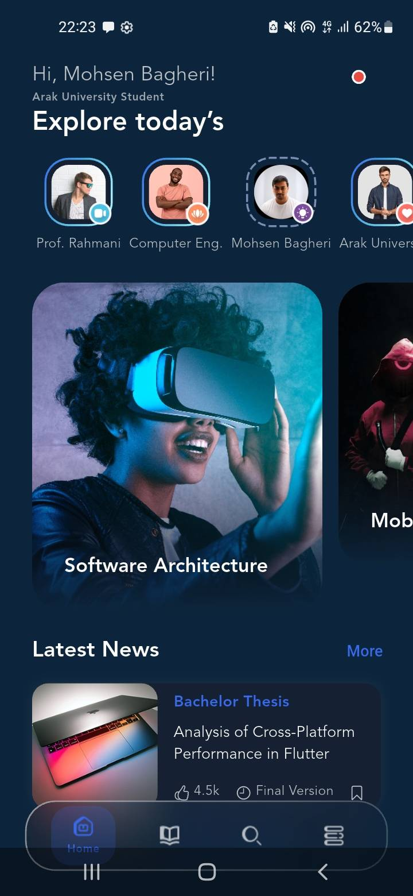
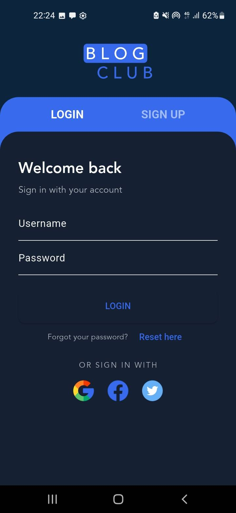

# Blog Club - Arak University Edition 🎓

A specialized version of the Blog Club application, developed by **Mohsen Bagheri**, a Computer Engineering student at **Arak University**. This project was created under the supervision of **Professor Mohsen Rahmani** to demonstrate the power of cross-platform development using a single codebase.

## 🏫 Academic Context
- **Institution:** Arak University (دانشگاه اراک)
- **Department:** Computer Engineering
- **Developer:** Mohsen Bagheri (محسن باقری)
- **Supervisor:** 
  - Prof. Mohsen Rahmani (محسن رحمانی)

## 🌐 Cross-Platform Achievement
The primary goal of this thesis project is to showcase Flutter's capability to deploy natively compiled applications across multiple platforms from a **single codebase**. 
- **Android:** Optimized APK/AAB with high frame rates.
- **iOS:** Compiled and tested for Apple devices, demonstrating seamless UI/UX adaptation.
- **Web:** Fully responsive web application running directly in the browser.

## ✨ Features
- **Custom Academic UI:** Personalized greeting and university branding.
- **Story Integration:** Features stories dedicated to university departments and faculty members.
- **Responsive Design:** Adaptive layouts that work flawlessly on mobile screens and desktop web browsers.
- **Modern Onboarding:** Dynamic introduction mentioning the academic context of the project.
- **Theming:** Clean, high-performance UI using Material 3 standards.

## 🛠️ Tech Stack & Optimization
- **Framework:** Flutter (Latest Stable)
- **Language:** Dart
- **Build System:** Gradle 8.12 with AGP 8.7.3 (Fully Optimized for Android)
- **State Management:** Preserving state across tabs using `IndexedStack`.
- **Performance:** 
  - Tree-shaken icons and fonts for minimal bundle size across all platforms.
  - Platform-specific rendering logic for optimal performance on Android, iOS, and Web.

## 📸 Screenshots

| Android / iOS  | Web Browser | Onboarding |
|:---:|:---:|:---:|
|  |  |  |

*(Note: Real screenshots of the personalized Arak University edition across different platforms)*

## 🚀 Installation
Install dependencies:

   - flutter pub get
   - Run the app (Select your target device):


   - flutter run -d chrome  # For Web
   - flutter run            # For Android/iOS
## 📝 License
This project is an academic submission for the Computer Engineering Department of Arak University.

1. **Clone the repo:**
```bash
   git clone [https://github.com/TheRootDirectory025/blogclub.git](https://github.com/TheRootDirectory025/blogclub.git)
