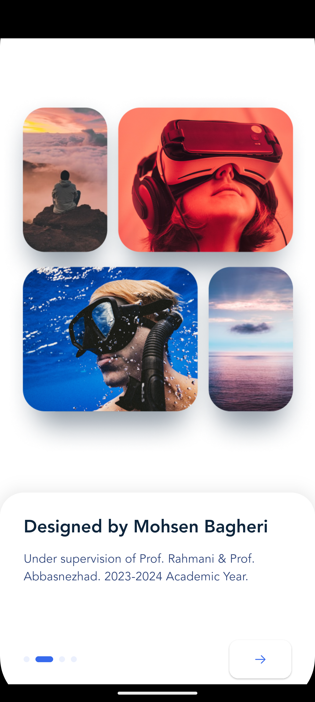

# Blog Club - Arak University Edition 🎓

A specialized version of the Blog Club application, developed by **Mohsen Bagheri**, a Computer Engineering student at **Arak University**. This project was created under the supervision of **Professor Mohsen Rahmani** and **Professor Mohammadreza Abbasnezhad**.

## 🏫 Academic Context
- **Institution:** Arak University (دانشگاه اراک)
- **Department:** Computer Engineering
- **Developer:** Mohsen Bagheri (محسن باقری)
- **Supervisors:** 
  - Prof. Mohsen Rahmani (محسن رحمانی)
  - Prof. M.R Abbasnezhad (محمدرضا عباس نژاد)

## ✨ Features

- **Custom Academic UI:** Personalized greeting for Mohsen Bagheri and university branding.
- **Story Integration:** Features stories dedicated to university departments and faculty members.
- **Curated Tech Content:** Articles specifically focused on advanced Flutter and mobile engineering.
- **Modern Onboarding:** Dynamic introduction mentioning the academic context of the project.
- **Theming:** Clean, high-performance UI using Material 3 standards.

## 🛠️ Tech Stack & Optimization

- **Framework:** Flutter (Latest Stable)
- **Build System:** Gradle 8.12 with AGP 8.7.3 (Fully Optimized)
- **State Management:** Preserving state across tabs using `IndexedStack`.
- **Performance:** 
  - Tree-shaken icons and fonts for minimal APK size.
  - Optimized rendering logic for high frame rates on Android devices.

## 📸 Screenshots

| Splash (Arak University) | Onboarding (Academic) | Home (Personalized) |
|:---:|:---:|:---:|
|  |  |  |

*(Note: Real screenshots of the personalized Arak University edition)*

## 🚀 Installation

1. **Clone the repo:**
   ```bash
   git clone https://github.com/YOUR_USERNAME/blogclub.git
   ```
2. **Install dependencies:**
   ```bash
   flutter pub get
   ```
3. **Run the app:**
   ```bash
   flutter run
   ```

## 📝 License
This project is an academic submission for the Computer Engineering Department of Arak University.
